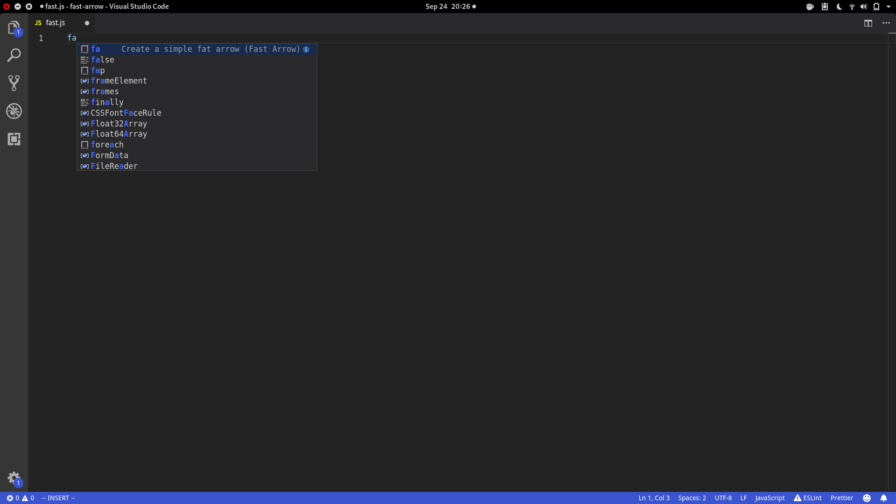
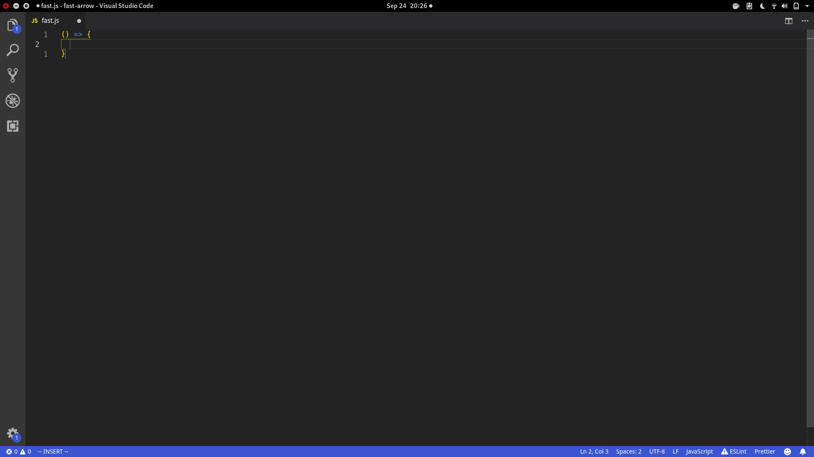

# About
This is an extension that lets you write fat arrow in less than 1 seconds. Writing `() => {}` takes 8 keyboard presses, now you can do it in 2. Just type in `fa` and press enter and you get your fast arrow!

## Features
By installing this extension, you will get couple of keywords to write out fast arrow. Here are the current keywords:

- fa (**f**ast **a**rrow)
- fap (**f**ast **a**rrow **p**arams)
- fai (**f**ast **a**rrow **i**nline)

Here is the way to create simple fat arrow

## Installation
You can download this from your vscode extension marketplace.

## On pull request
If you have any ideas for improvement, fork the repo and do some pull request. Any kind of help is really appreciated!